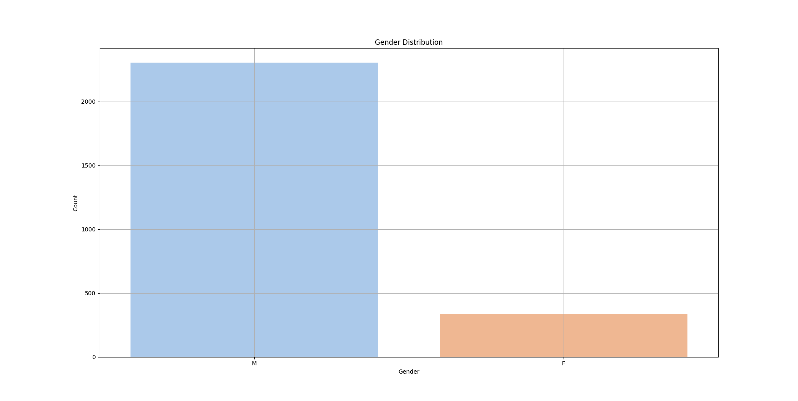
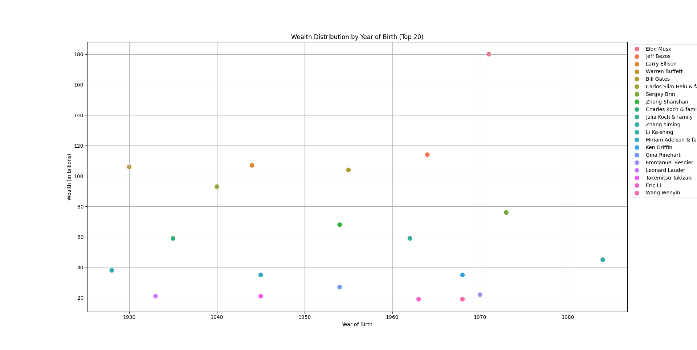
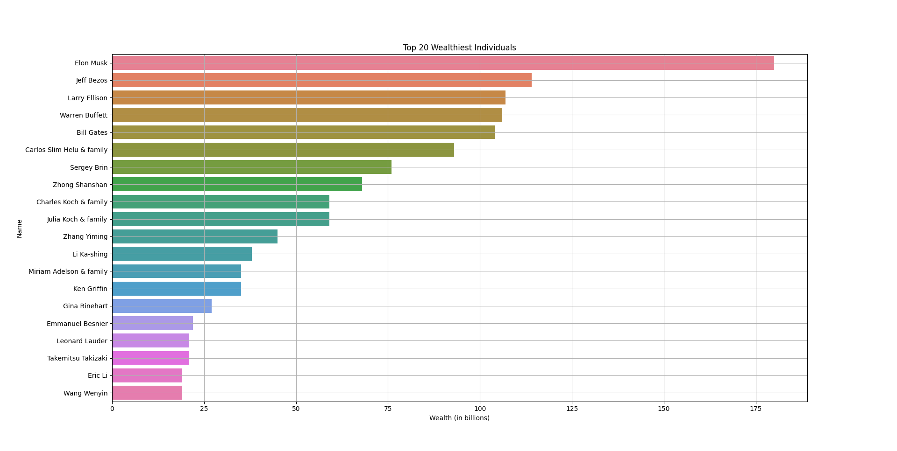

# Billionaire Data Management System

## Project Description
This project focuses on managing, analyzing, and visualizing data related to global billionaires. The core of the project involves a C program designed to store and manipulate billionaire data, utilizing a doubly linked circular list. Additionally, Python scripts are used for generating visualizations to uncover wealth distribution trends.

## Setup Instructions

Step 1. Clone the repository:
```bash
git clone https://github.com/YourUsername/Billionaire-Data-Management-System.git
```
Step 2. Navigate to the project directory:
```bash
cd Billionaire-Data-Management-System
```
Step 3. Compile the C program (optional if using a Makefile):
```bash
cd src
make
```

## Usage

Step 1. Run the `richmen` C program to manage and analyze billionaire data:
```bash
./richmen
```

Step 2. Run the Python scripts to generate visualizations (if applicable):
```bash
python scripts/visualize_data.py
```

## Results

The results of the analysis can be found in the `results/` folder, which includes generated visualizations and analysis summaries.

## Sample Output

### General Gender Distribution


### Top 20 Wealth Distribution by Birth Year


### Top 20 Wealthiest Individuals
